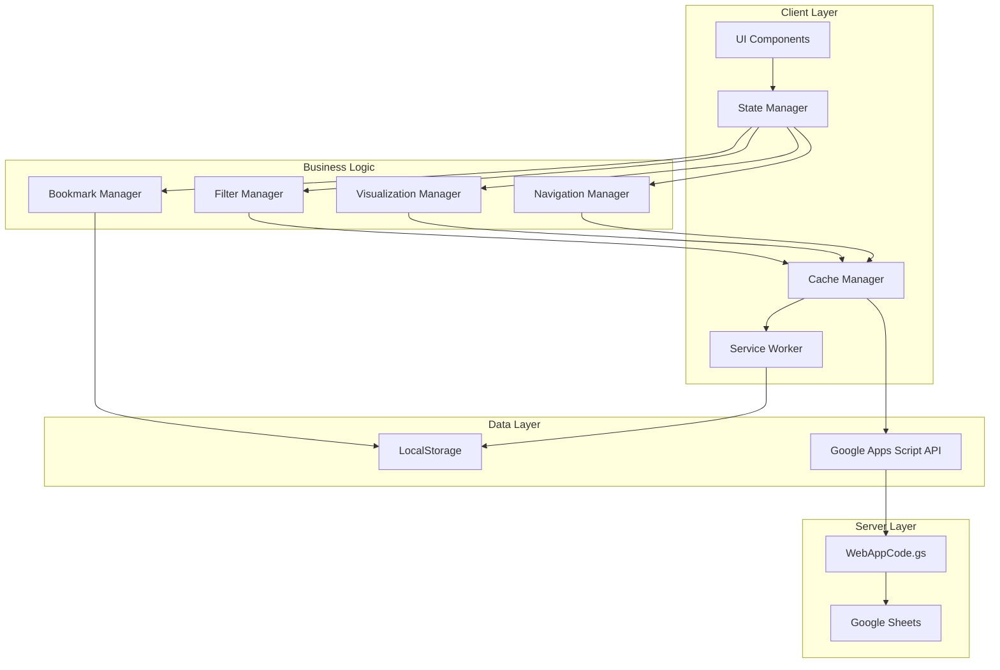

# Design Document: Dashboard UX Enhancements

## Overview

Цей документ описує архітектуру та дизайн покращень користувацького досвіду для аналітичної панелі. Фокус на модульній архітектурі з чистим розділенням відповідальності, використанням сучасних веб-технологій (Service Workers, LocalStorage, Touch Events) та прогресивному покращенні (Progressive Enhancement).

Поточна архітектура складається з:
- **Frontend**: HTML/CSS/JavaScript (WebApp.html) - монолітний файл
- **Backend**: Google Apps Script (WebAppCode.gs) - серверні функції
- **Data Source**: Google Sheets через SpreadsheetApp API

Нова архітектура буде розширена модульними компонентами для кожної функції.

## Architecture

### High-Level Architecture



### Module Structure

```
WebApp/
├── index.html (entry point)
├── styles/
│   ├── main.css (base styles)
│   ├── themes.css (light/dark themes)
│   └── mobile.css (mobile-specific)
├── scripts/
│   ├── core/
│   │   ├── state-manager.js
│   │   ├── cache-manager.js
│   │   └── api-client.js
│   ├── features/
│   │   ├── filters.js
│   │   ├── visualization.js
│   │   ├── navigation.js
│   │   ├── bookmarks.js
│   │   ├── comparison.js
│   │   ├── search.js
│   │   └── share.js
│   ├── ui/
│   │   ├── table-renderer.js
│   │   ├── lazy-loader.js
│   │   └── gesture-handler.js
│   └── utils/
│       ├── date-utils.js
│       ├── color-utils.js
│       └── storage-utils.js
└── service-worker.js
```

### Data Flow

1. **Initial Load**: UI → State Manager → Cache Manager → Check LocalStorage → API (if needed) → Render
2. **Navigation**: User Action → Navigation Manager → State Manager → Cache Manager → Render
3. **Filtering**: User Input → Filter Manager → State Manager → Re-render (client-side)
4. **Offline**: UI → Cache Manager → LocalStorage → Render (cached data)

## Components and Interfaces

### 1. State Manager

Центральний менеджер стану додатку з реактивною моделлю.

```javascript
class StateManager {
  constructor() {
    this.state = {
      currentSheet: null,
      currentData: [],
      filteredData: [],
      filters: {
        search: '',
        dateRange: null,
        subdivision: '',
        quickFilter: null
      },
      bookmarks: [],
      theme: 'light',
      isOnline: navigator.onLine,
      comparison: null
    };
    this.subscribers = [];
  }

  // Оновлення стану з повідомленням підписників
  setState(updates) {
    this.state = { ...this.state, ...updates };
    this.notifySubscribers();
  }

  // Підписка на зміни стану
  subscribe(callback) {
    this.subscribers.push(callback);
    return () => {
      this.subscribers = this.subscribers.filter(cb => cb !== callback);
    };
  }

  notifySubscribers() {
    this.subscribers.forEach(callback => callback(this.state));
  }

  getState() {
    return { ...this.state };
  }
}
```

### 2. Cache Manager

Управління кешуванням даних з підтримкою TTL та LRU eviction.

```javascript
class CacheManager {
  constructor() {
    this.CACHE_PREFIX = 'dashboard_cache_';
    this.CACHE_TTL = 24 * 60 * 60 * 1000; // 24 години
    this.MAX_CACHE_SIZE = 50; // максимум 50 листів
  }

  // Збереження даних в кеш
  set(key, data) {
    const cacheEntry = {
      data: data,
      timestamp: Date.now(),
      accessCount: 0
    };
    
    try {
      localStorage.setItem(
        this.CACHE_PREFIX + key,
        JSON.stringify(cacheEntry)
      );
      this.enforceMaxSize();
    } catch (e) {
      if (e.name === 'QuotaExceededError') {
        this.evictLRU();
        this.set(key, data); // Retry
      }
    }
  }

  // Отримання даних з кешу
  get(key) {
    const cached = localStorage.getItem(this.CACHE_PREFIX + key);
    if (!cached) return null;

    const entry = JSON.parse(cached);
    
    // Перевірка TTL
    if (Date.now() - entry.timestamp > this.CACHE_TTL) {
      this.remove(key);
      return null;
    }

    // Оновлення статистики доступу
    entry.accessCount++;
    entry.lastAccess = Date.now();
    localStorage.setItem(
      this.CACHE_PREFIX + key,
      JSON.stringify(entry)
    );

    return entry.data;
  }

  // Видалення найменш використовуваних записів
  evictLRU() {
    const entries = this.getAllEntries();
    if (entries.length === 0) return;

    // Сортування за accessCount та lastAccess
    entries.sort((a, b) => {
      if (a.accessCount !== b.accessCount) {
        return a.accessCount - b.accessCount;
      }
      return a.lastAccess - b.lastAccess;
    });

    // Видалення 20% найменш використовуваних
    const toRemove = Math.ceil(entries.length * 0.2);
    for (let i = 0; i < toRemove; i++) {
      this.remove(entries[i].key);
    }
  }

  getAllEntries() {
    const entries = [];
    for (let i = 0; i < localStorage.length; i++) {
      const key = localStorage.key(i);
      if (key.startsWith(this.CACHE_PREFIX)) {
        const entry = JSON.parse(localStorage.getItem(key));
        entries.push({
          key: key.replace(this.CACHE_PREFIX, ''),
          ...entry
        });
      }
    }
    return entries;
  }

  enforceMaxSize() {
    const entries = this.getAllEntries();
    if (entries.length > this.MAX_CACHE_SIZE) {
      this.evictLRU();
    }
  }

  remove(key) {
    localStorage.removeItem(this.CACHE_PREFIX + key);
  }

  clear() {
    const keys = [];
    for (let i = 0; i < localStorage.length; i++) {
      const key = localStorage.key(i);
      if (key.startsWith(this.CACHE_PREFIX)) {
        keys.push(key);
      }
    }
    keys.forEach(key => localStorage.removeItem(key));
  }
}
```


### 3. Visualization Manager

Управління кольоровим кодуванням та візуальними індикаторами.

```javascript
class VisualizationManager {
  constructor() {
    this.icons = {
      'РЕБ': '📊',
      'Речова': '📦',
      'ЕТС': '⚡',
      'Інж': '🔧',
      'СІІЗ': '🛡️',
      'Прод': '🍎',
      'Різниця Інж': '📈',
      'Різниця Прод': '📉',
      'Різниця ЕТС': '⚡📊',
      'Різниця СІІЗ': '🛡️📊',
      'Різниця РЕБ': '📊📈',
      'Різниця Речова': '📦📊',
      'ArchiveBackup': '🗄️'
    };
  }

  // Отримання іконки для листа
  getSheetIcon(sheetName) {
    return this.icons[sheetName] || '📄';
  }

  // Кольорове кодування для змін
  colorizeChange(value, previousValue) {
    if (!previousValue || value === previousValue) {
      return { color: '#6c757d', arrow: '', class: 'neutral' };
    }

    const numValue = parseFloat(value);
    const numPrevious = parseFloat(previousValue);

    if (isNaN(numValue) || isNaN(numPrevious)) {
      return { color: '#6c757d', arrow: '', class: 'neutral' };
    }

    const diff = numValue - numPrevious;
    const percentChange = Math.abs((diff / numPrevious) * 100);

    if (diff > 0) {
      const intensity = Math.min(percentChange / 10, 1); // 0-1 scale
      const color = this.interpolateColor('#d4edda', '#28a745', intensity);
      return {
        color: color,
        arrow: '↑',
        class: 'positive',
        change: diff,
        percent: percentChange
      };
    } else if (diff < 0) {
      const intensity = Math.min(percentChange / 10, 1);
      const color = this.interpolateColor('#f8d7da', '#dc3545', intensity);
      return {
        color: color,
        arrow: '↓',
        class: 'negative',
        change: diff,
        percent: percentChange
      };
    }

    return { color: '#6c757d', arrow: '', class: 'neutral' };
  }

  // Інтерполяція кольорів
  interpolateColor(color1, color2, factor) {
    const c1 = this.hexToRgb(color1);
    const c2 = this.hexToRgb(color2);
    
    const r = Math.round(c1.r + factor * (c2.r - c1.r));
    const g = Math.round(c1.g + factor * (c2.g - c1.g));
    const b = Math.round(c1.b + factor * (c2.b - c1.b));
    
    return this.rgbToHex(r, g, b);
  }

  hexToRgb(hex) {
    const result = /^#?([a-f\d]{2})([a-f\d]{2})([a-f\d]{2})$/i.exec(hex);
    return result ? {
      r: parseInt(result[1], 16),
      g: parseInt(result[2], 16),
      b: parseInt(result[3], 16)
    } : null;
  }

  rgbToHex(r, g, b) {
    return "#" + ((1 << 24) + (r << 16) + (g << 8) + b).toString(16).slice(1);
  }
}
```

### 4. Filter Manager

Управління всіма типами фільтрів з підтримкою швидких фільтрів.

```javascript
class FilterManager {
  constructor(stateManager) {
    this.stateManager = stateManager;
    this.quickFilters = {
      'today': () => this.filterByDays(0),
      'week': () => this.filterByDays(7),
      'month': () => this.filterByDays(30),
      'quarter': () => this.filterByDays(90)
    };
  }

  // Застосування всіх фільтрів
  applyFilters(data) {
    const state = this.stateManager.getState();
    let filtered = [...data];

    // Швидкий фільтр за датою
    if (state.filters.quickFilter) {
      const filterFn = this.quickFilters[state.filters.quickFilter];
      if (filterFn) {
        filtered = filterFn(filtered);
      }
    }

    // Пошук
    if (state.filters.search) {
      filtered = this.filterBySearch(filtered, state.filters.search);
    }

    // Діапазон дат
    if (state.filters.dateRange) {
      filtered = this.filterByDateRange(filtered, state.filters.dateRange);
    }

    // Підрозділ
    if (state.filters.subdivision) {
      filtered = this.filterBySubdivision(filtered, state.filters.subdivision);
    }

    return filtered;
  }

  filterByDays(days) {
    return (data) => {
      const cutoffDate = new Date();
      cutoffDate.setDate(cutoffDate.getDate() - days);

      return data.filter(row => {
        const rowDate = this.parseDate(row[0]);
        return rowDate && rowDate >= cutoffDate;
      });
    };
  }

  filterBySearch(data, searchTerm) {
    const term = searchTerm.toLowerCase();
    return data.filter(row =>
      row.some(cell => String(cell).toLowerCase().includes(term))
    );
  }

  filterByDateRange(data, dateRange) {
    const { start, end } = dateRange;
    return data.filter(row => {
      const rowDate = this.parseDate(row[0]);
      if (!rowDate) return false;
      return rowDate >= start && rowDate <= end;
    });
  }

  filterBySubdivision(data, subdivision) {
    return data.filter(row => row[0] === subdivision);
  }

  parseDate(dateStr) {
    // Підтримка різних форматів дат
    const formats = [
      /(\d{2})\.(\d{2})\.(\d{4})/, // DD.MM.YYYY
      /(\d{4})-(\d{2})-(\d{2})/, // YYYY-MM-DD
    ];

    for (const format of formats) {
      const match = String(dateStr).match(format);
      if (match) {
        if (format === formats[0]) {
          return new Date(match[3], match[2] - 1, match[1]);
        } else {
          return new Date(match[1], match[2] - 1, match[3]);
        }
      }
    }

    return null;
  }
}
```


### 5. Navigation Manager

Управління навігацією з підтримкою свайпів та клавіатури.

```javascript
class NavigationManager {
  constructor(stateManager) {
    this.stateManager = stateManager;
    this.sheets = [
      'РЕБ', 'Речова', 'ЕТС', 'Інж', 'СІІЗ', 'Прод',
      'Різниця Інж', 'Різниця Прод', 'Різниця ЕТС',
      'Різниця СІІЗ', 'Різниця РЕБ', 'Різниця Речова',
      'ArchiveBackup'
    ];
    this.currentIndex = 0;
    this.initGestures();
    this.initKeyboard();
  }

  initGestures() {
    if (!('ontouchstart' in window)) return;

    let touchStartX = 0;
    let touchEndX = 0;
    const threshold = 50; // мінімальна відстань для свайпу

    document.addEventListener('touchstart', (e) => {
      touchStartX = e.changedTouches[0].screenX;
    }, { passive: true });

    document.addEventListener('touchend', (e) => {
      touchEndX = e.changedTouches[0].screenX;
      this.handleSwipe(touchStartX, touchEndX, threshold);
    }, { passive: true });
  }

  handleSwipe(startX, endX, threshold) {
    const diff = startX - endX;

    if (Math.abs(diff) < threshold) return;

    if (diff > 0) {
      // Свайп вліво - наступний лист
      this.next();
    } else {
      // Свайп вправо - попередній лист
      this.previous();
    }
  }

  initKeyboard() {
    document.addEventListener('keydown', (e) => {
      if (e.key === 'ArrowLeft') {
        this.previous();
      } else if (e.key === 'ArrowRight') {
        this.next();
      }
    });
  }

  next() {
    if (this.currentIndex < this.sheets.length - 1) {
      this.currentIndex++;
      this.navigateTo(this.sheets[this.currentIndex]);
    } else {
      this.showBounceEffect('right');
    }
  }

  previous() {
    if (this.currentIndex > 0) {
      this.currentIndex--;
      this.navigateTo(this.sheets[this.currentIndex]);
    } else {
      this.showBounceEffect('left');
    }
  }

  navigateTo(sheetName) {
    this.currentIndex = this.sheets.indexOf(sheetName);
    this.stateManager.setState({ currentSheet: sheetName });
    // Trigger load
    window.loadSheet(sheetName);
  }

  showBounceEffect(direction) {
    const container = document.querySelector('.container');
    container.classList.add(`bounce-${direction}`);
    setTimeout(() => {
      container.classList.remove(`bounce-${direction}`);
    }, 300);
  }
}
```

### 6. Bookmark Manager

Управління закладками з збереженням в LocalStorage.

```javascript
class BookmarkManager {
  constructor(stateManager) {
    this.stateManager = stateManager;
    this.STORAGE_KEY = 'dashboard_bookmarks';
    this.loadBookmarks();
  }

  loadBookmarks() {
    const saved = localStorage.getItem(this.STORAGE_KEY);
    const bookmarks = saved ? JSON.parse(saved) : [];
    this.stateManager.setState({ bookmarks });
  }

  saveBookmarks(bookmarks) {
    localStorage.setItem(this.STORAGE_KEY, JSON.stringify(bookmarks));
    this.stateManager.setState({ bookmarks });
  }

  toggle(sheetName) {
    const state = this.stateManager.getState();
    const bookmarks = [...state.bookmarks];
    const index = bookmarks.indexOf(sheetName);

    if (index > -1) {
      bookmarks.splice(index, 1);
    } else {
      bookmarks.push(sheetName);
    }

    this.saveBookmarks(bookmarks);
    return index === -1; // true якщо додано
  }

  isBookmarked(sheetName) {
    const state = this.stateManager.getState();
    return state.bookmarks.includes(sheetName);
  }

  getBookmarks() {
    const state = this.stateManager.getState();
    return state.bookmarks;
  }
}
```

### 7. Lazy Loader

Віртуалізація таблиці для великих датасетів.

```javascript
class LazyLoader {
  constructor(containerSelector) {
    this.container = document.querySelector(containerSelector);
    this.rowHeight = 40; // висота рядка в px
    this.visibleRows = 50;
    this.buffer = 10; // додаткові рядки зверху/знизу
    this.allData = [];
    this.renderedRange = { start: 0, end: 0 };
    
    this.initScrollListener();
  }

  initScrollListener() {
    this.container.addEventListener('scroll', () => {
      this.updateVisibleRows();
    }, { passive: true });
  }

  setData(data) {
    this.allData = data;
    this.updateVisibleRows();
  }

  updateVisibleRows() {
    const scrollTop = this.container.scrollTop;
    const containerHeight = this.container.clientHeight;

    const startIndex = Math.max(
      0,
      Math.floor(scrollTop / this.rowHeight) - this.buffer
    );
    const endIndex = Math.min(
      this.allData.length,
      Math.ceil((scrollTop + containerHeight) / this.rowHeight) + this.buffer
    );

    // Рендер тільки якщо діапазон змінився
    if (startIndex !== this.renderedRange.start || 
        endIndex !== this.renderedRange.end) {
      this.renderRows(startIndex, endIndex);
      this.renderedRange = { start: startIndex, end: endIndex };
    }
  }

  renderRows(start, end) {
    const tbody = this.container.querySelector('tbody');
    const fragment = document.createDocumentFragment();

    // Spacer зверху
    const topSpacer = document.createElement('tr');
    topSpacer.style.height = `${start * this.rowHeight}px`;
    fragment.appendChild(topSpacer);

    // Видимі рядки
    for (let i = start; i < end; i++) {
      const row = this.createRow(this.allData[i]);
      fragment.appendChild(row);
    }

    // Spacer знизу
    const bottomSpacer = document.createElement('tr');
    const remainingRows = this.allData.length - end;
    bottomSpacer.style.height = `${remainingRows * this.rowHeight}px`;
    fragment.appendChild(bottomSpacer);

    tbody.innerHTML = '';
    tbody.appendChild(fragment);
  }

  createRow(rowData) {
    const tr = document.createElement('tr');
    rowData.forEach(cell => {
      const td = document.createElement('td');
      td.textContent = cell;
      tr.appendChild(td);
    });
    return tr;
  }
}
```


### 8. Comparison Manager

Порівняння даних між двома датами.

```javascript
class ComparisonManager {
  constructor(stateManager) {
    this.stateManager = stateManager;
  }

  compare(data, date1, date2) {
    const rows1 = this.findRowsByDate(data, date1);
    const rows2 = this.findRowsByDate(data, date2);

    if (!rows1 || !rows2) {
      throw new Error('Дані для однієї з дат не знайдено');
    }

    return this.calculateDifferences(rows1, rows2);
  }

  findRowsByDate(data, targetDate) {
    return data.find(row => {
      const rowDate = this.parseDate(row[0]);
      return rowDate && this.isSameDay(rowDate, targetDate);
    });
  }

  calculateDifferences(row1, row2) {
    const differences = [];

    for (let i = 0; i < Math.max(row1.length, row2.length); i++) {
      const val1 = row1[i];
      const val2 = row2[i];

      const num1 = parseFloat(val1);
      const num2 = parseFloat(val2);

      if (!isNaN(num1) && !isNaN(num2)) {
        const diff = num2 - num1;
        const percent = num1 !== 0 ? ((diff / num1) * 100).toFixed(2) : 'N/A';
        
        differences.push({
          column: i,
          value1: val1,
          value2: val2,
          difference: diff,
          percentChange: percent,
          direction: diff > 0 ? 'up' : diff < 0 ? 'down' : 'same'
        });
      } else {
        differences.push({
          column: i,
          value1: val1,
          value2: val2,
          difference: null,
          percentChange: null,
          direction: 'same'
        });
      }
    }

    return differences;
  }

  parseDate(dateStr) {
    // Використовуємо той самий парсер, що і в FilterManager
    const formats = [
      /(\d{2})\.(\d{2})\.(\d{4})/,
      /(\d{4})-(\d{2})-(\d{2})/,
    ];

    for (const format of formats) {
      const match = String(dateStr).match(format);
      if (match) {
        if (format === formats[0]) {
          return new Date(match[3], match[2] - 1, match[1]);
        } else {
          return new Date(match[1], match[2] - 1, match[3]);
        }
      }
    }

    return null;
  }

  isSameDay(date1, date2) {
    return date1.getFullYear() === date2.getFullYear() &&
           date1.getMonth() === date2.getMonth() &&
           date1.getDate() === date2.getDate();
  }
}
```

### 9. Share Manager

Генерація та обробка посилань для поділу.

```javascript
class ShareManager {
  constructor(stateManager) {
    this.stateManager = stateManager;
  }

  generateShareLink() {
    const state = this.stateManager.getState();
    const params = new URLSearchParams();

    params.set('sheet', state.currentSheet);

    if (state.filters.search) {
      params.set('search', state.filters.search);
    }

    if (state.filters.quickFilter) {
      params.set('filter', state.filters.quickFilter);
    }

    if (state.filters.dateRange) {
      params.set('dateStart', state.filters.dateRange.start.toISOString());
      params.set('dateEnd', state.filters.dateRange.end.toISOString());
    }

    if (state.filters.subdivision) {
      params.set('subdivision', state.filters.subdivision);
    }

    const url = `${window.location.origin}${window.location.pathname}?${params.toString()}`;
    return url;
  }

  async copyToClipboard(text) {
    try {
      await navigator.clipboard.writeText(text);
      return true;
    } catch (err) {
      // Fallback для старих браузерів
      const textarea = document.createElement('textarea');
      textarea.value = text;
      textarea.style.position = 'fixed';
      textarea.style.opacity = '0';
      document.body.appendChild(textarea);
      textarea.select();
      const success = document.execCommand('copy');
      document.body.removeChild(textarea);
      return success;
    }
  }

  parseShareLink() {
    const params = new URLSearchParams(window.location.search);
    const config = {};

    if (params.has('sheet')) {
      config.sheet = params.get('sheet');
    }

    if (params.has('search')) {
      config.search = params.get('search');
    }

    if (params.has('filter')) {
      config.quickFilter = params.get('filter');
    }

    if (params.has('dateStart') && params.has('dateEnd')) {
      config.dateRange = {
        start: new Date(params.get('dateStart')),
        end: new Date(params.get('dateEnd'))
      };
    }

    if (params.has('subdivision')) {
      config.subdivision = params.get('subdivision');
    }

    return config;
  }

  async share() {
    const url = this.generateShareLink();

    // Використання Web Share API якщо доступно (мобільні)
    if (navigator.share) {
      try {
        await navigator.share({
          title: 'Аналітична Панель',
          text: `Перегляньте дані: ${this.stateManager.getState().currentSheet}`,
          url: url
        });
        return { success: true, method: 'native' };
      } catch (err) {
        if (err.name !== 'AbortError') {
          console.error('Share failed:', err);
        }
      }
    }

    // Fallback - копіювання в буфер
    const copied = await this.copyToClipboard(url);
    return { success: copied, method: 'clipboard' };
  }
}
```


### 10. Pull-to-Refresh Handler

Обробка жесту pull-to-refresh для мобільних пристроїв.

```javascript
class PullToRefreshHandler {
  constructor(onRefresh) {
    this.onRefresh = onRefresh;
    this.threshold = 80; // відстань для активації
    this.maxPull = 120;
    this.startY = 0;
    this.currentY = 0;
    this.pulling = false;
    this.refreshing = false;
    
    this.init();
  }

  init() {
    if (!('ontouchstart' in window)) return;

    const container = document.querySelector('.content');
    
    container.addEventListener('touchstart', (e) => {
      if (container.scrollTop === 0) {
        this.startY = e.touches[0].clientY;
        this.pulling = true;
      }
    }, { passive: true });

    container.addEventListener('touchmove', (e) => {
      if (!this.pulling || this.refreshing) return;

      this.currentY = e.touches[0].clientY;
      const pullDistance = Math.min(
        this.currentY - this.startY,
        this.maxPull
      );

      if (pullDistance > 0) {
        this.updateIndicator(pullDistance);
      }
    }, { passive: true });

    container.addEventListener('touchend', () => {
      if (!this.pulling || this.refreshing) return;

      const pullDistance = this.currentY - this.startY;

      if (pullDistance > this.threshold) {
        this.triggerRefresh();
      } else {
        this.resetIndicator();
      }

      this.pulling = false;
    }, { passive: true });
  }

  updateIndicator(distance) {
    const indicator = document.getElementById('pullIndicator');
    const progress = Math.min(distance / this.threshold, 1);
    
    indicator.style.transform = `translateY(${distance}px)`;
    indicator.style.opacity = progress;
    
    if (progress >= 1) {
      indicator.classList.add('ready');
    } else {
      indicator.classList.remove('ready');
    }
  }

  async triggerRefresh() {
    this.refreshing = true;
    const indicator = document.getElementById('pullIndicator');
    indicator.classList.add('refreshing');

    try {
      await this.onRefresh();
    } finally {
      setTimeout(() => {
        this.resetIndicator();
        this.refreshing = false;
      }, 500);
    }
  }

  resetIndicator() {
    const indicator = document.getElementById('pullIndicator');
    indicator.style.transform = 'translateY(0)';
    indicator.style.opacity = '0';
    indicator.classList.remove('ready', 'refreshing');
  }
}
```

## Data Models

### State Model

```typescript
interface AppState {
  currentSheet: string | null;
  currentData: any[][];
  filteredData: any[][];
  filters: {
    search: string;
    dateRange: DateRange | null;
    subdivision: string;
    quickFilter: 'today' | 'week' | 'month' | 'quarter' | null;
  };
  bookmarks: string[];
  theme: 'light' | 'dark';
  isOnline: boolean;
  comparison: ComparisonData | null;
}

interface DateRange {
  start: Date;
  end: Date;
}

interface ComparisonData {
  date1: Date;
  date2: Date;
  differences: Difference[];
}

interface Difference {
  column: number;
  value1: any;
  value2: any;
  difference: number | null;
  percentChange: string | null;
  direction: 'up' | 'down' | 'same';
}
```

### Cache Entry Model

```typescript
interface CacheEntry {
  data: any[][];
  timestamp: number;
  accessCount: number;
  lastAccess?: number;
}
```

### Sheet Configuration Model

```typescript
interface SheetConfig {
  name: string;
  icon: string;
  range: string;
  category: 'reports' | 'history' | 'archive';
  hasComparison: boolean;
}
```

## Error Handling

### Error Types

```javascript
class DashboardError extends Error {
  constructor(message, type, details = {}) {
    super(message);
    this.name = 'DashboardError';
    this.type = type;
    this.details = details;
  }
}

// Типи помилок
const ErrorTypes = {
  NETWORK: 'NETWORK_ERROR',
  CACHE: 'CACHE_ERROR',
  DATA: 'DATA_ERROR',
  PERMISSION: 'PERMISSION_ERROR',
  QUOTA: 'QUOTA_EXCEEDED'
};
```

### Error Handler

```javascript
class ErrorHandler {
  static handle(error) {
    console.error('Dashboard Error:', error);

    let userMessage = 'Виникла помилка. Спробуйте ще раз.';
    let canRetry = true;

    if (error instanceof DashboardError) {
      switch (error.type) {
        case ErrorTypes.NETWORK:
          userMessage = 'Немає з\'єднання з інтернетом. Показано кешовані дані.';
          canRetry = true;
          break;
        case ErrorTypes.CACHE:
          userMessage = 'Помилка кешу. Дані будуть завантажені з сервера.';
          canRetry = true;
          break;
        case ErrorTypes.DATA:
          userMessage = 'Помилка обробки даних. Перевірте формат таблиці.';
          canRetry = false;
          break;
        case ErrorTypes.QUOTA:
          userMessage = 'Перевищено ліміт сховища. Кеш буде очищено.';
          canRetry = true;
          break;
      }
    }

    this.showNotification(userMessage, canRetry);
  }

  static showNotification(message, canRetry) {
    // Показати toast notification
    const toast = document.createElement('div');
    toast.className = 'toast error';
    toast.textContent = message;
    
    if (canRetry) {
      const retryBtn = document.createElement('button');
      retryBtn.textContent = 'Повторити';
      retryBtn.onclick = () => window.location.reload();
      toast.appendChild(retryBtn);
    }

    document.body.appendChild(toast);
    
    setTimeout(() => {
      toast.classList.add('show');
    }, 100);

    setTimeout(() => {
      toast.classList.remove('show');
      setTimeout(() => toast.remove(), 300);
    }, 5000);
  }
}
```


## Testing Strategy

### Unit Testing

Кожен модуль буде покритий unit тестами з використанням Jest або подібного фреймворку.

**Приклад тестів для CacheManager:**

```javascript
describe('CacheManager', () => {
  let cacheManager;

  beforeEach(() => {
    localStorage.clear();
    cacheManager = new CacheManager();
  });

  test('should store and retrieve data', () => {
    const testData = [[1, 2, 3], [4, 5, 6]];
    cacheManager.set('test-sheet', testData);
    
    const retrieved = cacheManager.get('test-sheet');
    expect(retrieved).toEqual(testData);
  });

  test('should return null for expired cache', () => {
    const testData = [[1, 2, 3]];
    cacheManager.CACHE_TTL = 0; // Instant expiry
    cacheManager.set('test-sheet', testData);
    
    const retrieved = cacheManager.get('test-sheet');
    expect(retrieved).toBeNull();
  });

  test('should evict LRU entries when quota exceeded', () => {
    cacheManager.MAX_CACHE_SIZE = 2;
    
    cacheManager.set('sheet1', [[1]]);
    cacheManager.set('sheet2', [[2]]);
    cacheManager.set('sheet3', [[3]]);
    
    expect(cacheManager.get('sheet1')).toBeNull();
    expect(cacheManager.get('sheet2')).not.toBeNull();
    expect(cacheManager.get('sheet3')).not.toBeNull();
  });
});
```

### Integration Testing

Тестування взаємодії між модулями.

```javascript
describe('Filter Integration', () => {
  let stateManager, filterManager;

  beforeEach(() => {
    stateManager = new StateManager();
    filterManager = new FilterManager(stateManager);
  });

  test('should apply multiple filters correctly', () => {
    const testData = [
      ['01.01.2024', 'Підрозділ А', 100],
      ['02.01.2024', 'Підрозділ Б', 200],
      ['03.01.2024', 'Підрозділ А', 150]
    ];

    stateManager.setState({
      filters: {
        search: 'Підрозділ А',
        quickFilter: 'week'
      }
    });

    const filtered = filterManager.applyFilters(testData);
    expect(filtered.length).toBe(2);
    expect(filtered[0][1]).toBe('Підрозділ А');
  });
});
```

### E2E Testing

Тестування користувацьких сценаріїв з використанням Playwright або Cypress.

```javascript
describe('User Workflows', () => {
  test('should navigate between sheets using swipe', async () => {
    await page.goto('/');
    
    // Симуляція свайпу
    await page.touchscreen.swipe({ x: 300, y: 200 }, { x: 100, y: 200 });
    
    // Перевірка, що лист змінився
    const sheetTitle = await page.textContent('#sheetTitle');
    expect(sheetTitle).not.toBe('Оберіть лист для перегляду');
  });

  test('should save and restore bookmarks', async () => {
    await page.goto('/');
    
    // Додати закладку
    await page.click('.nav-btn:first-child');
    await page.click('.bookmark-btn');
    
    // Перезавантажити сторінку
    await page.reload();
    
    // Перевірити, що закладка збережена
    const bookmarks = await page.$$('.bookmarked');
    expect(bookmarks.length).toBeGreaterThan(0);
  });
});
```

### Performance Testing

Тестування продуктивності для великих датасетів.

```javascript
describe('Performance', () => {
  test('should render 10000 rows within 2 seconds', async () => {
    const largeDataset = Array(10000).fill(null).map((_, i) => 
      [i, `Row ${i}`, Math.random() * 1000]
    );

    const startTime = performance.now();
    
    const lazyLoader = new LazyLoader('#dataTable');
    lazyLoader.setData(largeDataset);
    
    const endTime = performance.now();
    const renderTime = endTime - startTime;
    
    expect(renderTime).toBeLessThan(2000);
  });

  test('should maintain 60 FPS during scroll', async () => {
    // Використання Performance Observer API
    const frameRates = [];
    
    const observer = new PerformanceObserver((list) => {
      for (const entry of list.getEntries()) {
        frameRates.push(1000 / entry.duration);
      }
    });
    
    observer.observe({ entryTypes: ['measure'] });
    
    // Симуляція прокрутки
    await simulateScroll();
    
    const avgFPS = frameRates.reduce((a, b) => a + b) / frameRates.length;
    expect(avgFPS).toBeGreaterThan(55); // Допустимо 55+ FPS
  });
});
```

## Service Worker Design

### Service Worker Lifecycle

```javascript
// service-worker.js

const CACHE_NAME = 'dashboard-v1';
const STATIC_ASSETS = [
  '/',
  '/styles/main.css',
  '/styles/themes.css',
  '/scripts/app.js',
  '/scripts/core/state-manager.js',
  // ... інші статичні файли
];

// Install
self.addEventListener('install', (event) => {
  event.waitUntil(
    caches.open(CACHE_NAME).then((cache) => {
      return cache.addAll(STATIC_ASSETS);
    })
  );
  self.skipWaiting();
});

// Activate
self.addEventListener('activate', (event) => {
  event.waitUntil(
    caches.keys().then((cacheNames) => {
      return Promise.all(
        cacheNames
          .filter((name) => name !== CACHE_NAME)
          .map((name) => caches.delete(name))
      );
    })
  );
  self.clients.claim();
});

// Fetch - Network First, fallback to Cache
self.addEventListener('fetch', (event) => {
  event.respondWith(
    fetch(event.request)
      .then((response) => {
        // Клонуємо відповідь для кешування
        const responseClone = response.clone();
        caches.open(CACHE_NAME).then((cache) => {
          cache.put(event.request, responseClone);
        });
        return response;
      })
      .catch(() => {
        // Якщо мережа недоступна, використовуємо кеш
        return caches.match(event.request);
      })
  );
});

// Background Sync для офлайн-дій
self.addEventListener('sync', (event) => {
  if (event.tag === 'sync-data') {
    event.waitUntil(syncData());
  }
});

async function syncData() {
  // Синхронізація даних після відновлення з'єднання
  const pendingActions = await getPendingActions();
  
  for (const action of pendingActions) {
    try {
      await executeAction(action);
      await removePendingAction(action.id);
    } catch (error) {
      console.error('Sync failed:', error);
    }
  }
}
```


## UI/UX Design Patterns

### Theme System

```css
/* themes.css */

:root {
  /* Light Theme */
  --bg-primary: #ffffff;
  --bg-secondary: #f8f9fa;
  --text-primary: #212529;
  --text-secondary: #6c757d;
  --accent-primary: #667eea;
  --accent-secondary: #764ba2;
  --border-color: #e9ecef;
  --shadow: rgba(0, 0, 0, 0.1);
  
  /* Status Colors */
  --success: #28a745;
  --success-bg: #d4edda;
  --danger: #dc3545;
  --danger-bg: #f8d7da;
  --warning: #ffc107;
  --warning-bg: #fff3cd;
}

[data-theme="dark"] {
  /* Dark Theme */
  --bg-primary: #1a1a1a;
  --bg-secondary: #2d2d2d;
  --text-primary: #e9ecef;
  --text-secondary: #adb5bd;
  --accent-primary: #7c8ff5;
  --accent-secondary: #9066c7;
  --border-color: #495057;
  --shadow: rgba(0, 0, 0, 0.5);
  
  /* Status Colors */
  --success: #40c463;
  --success-bg: #1a3d2a;
  --danger: #f85149;
  --danger-bg: #3d1a1a;
  --warning: #d29922;
  --warning-bg: #3d2e1a;
}

/* Smooth transitions */
* {
  transition: background-color 0.3s ease, color 0.3s ease, border-color 0.3s ease;
}
```

### Animation Patterns

```css
/* Bounce effect for navigation boundaries */
@keyframes bounce-left {
  0%, 100% { transform: translateX(0); }
  50% { transform: translateX(-20px); }
}

@keyframes bounce-right {
  0%, 100% { transform: translateX(0); }
  50% { transform: translateX(20px); }
}

.bounce-left {
  animation: bounce-left 0.3s ease-out;
}

.bounce-right {
  animation: bounce-right 0.3s ease-out;
}

/* Slide transition for sheet changes */
@keyframes slide-in-right {
  from {
    transform: translateX(100%);
    opacity: 0;
  }
  to {
    transform: translateX(0);
    opacity: 1;
  }
}

@keyframes slide-in-left {
  from {
    transform: translateX(-100%);
    opacity: 0;
  }
  to {
    transform: translateX(0);
    opacity: 1;
  }
}

.slide-in-right {
  animation: slide-in-right 0.3s ease-out;
}

.slide-in-left {
  animation: slide-in-left 0.3s ease-out;
}

/* Pull-to-refresh indicator */
.pull-indicator {
  position: fixed;
  top: 0;
  left: 50%;
  transform: translateX(-50%) translateY(-100%);
  padding: 10px 20px;
  background: var(--accent-primary);
  color: white;
  border-radius: 0 0 10px 10px;
  opacity: 0;
  transition: all 0.3s ease;
}

.pull-indicator.ready {
  background: var(--success);
}

.pull-indicator.refreshing {
  animation: spin 1s linear infinite;
}

@keyframes spin {
  from { transform: translateX(-50%) translateY(0) rotate(0deg); }
  to { transform: translateX(-50%) translateY(0) rotate(360deg); }
}
```

### Responsive Breakpoints

```css
/* Mobile First Approach */

/* Base styles for mobile (< 768px) */
.container {
  padding: 10px;
}

.nav {
  grid-template-columns: 1fr;
}

/* Tablet (768px - 1024px) */
@media (min-width: 768px) {
  .container {
    padding: 20px;
  }
  
  .nav {
    grid-template-columns: repeat(2, 1fr);
  }
  
  .filters {
    flex-direction: row;
  }
}

/* Desktop (> 1024px) */
@media (min-width: 1024px) {
  .container {
    padding: 30px;
    max-width: 1400px;
  }
  
  .nav {
    grid-template-columns: repeat(3, 1fr);
  }
  
  .data-table {
    font-size: 14px;
  }
}

/* Large Desktop (> 1440px) */
@media (min-width: 1440px) {
  .container {
    max-width: 1600px;
  }
  
  .nav {
    grid-template-columns: repeat(4, 1fr);
  }
}
```

### Touch-Friendly UI Elements

```css
/* Збільшені зони натискання для мобільних */
@media (max-width: 768px) {
  .nav-btn,
  .btn-pdf,
  .btn-clear {
    min-height: 44px; /* Apple's recommended touch target */
    padding: 12px 16px;
  }
  
  .bookmark-btn {
    width: 44px;
    height: 44px;
  }
  
  /* Збільшені чекбокси та радіо-кнопки */
  input[type="checkbox"],
  input[type="radio"] {
    width: 24px;
    height: 24px;
  }
}
```

## Performance Optimization

### Code Splitting Strategy

```javascript
// Динамічний імпорт модулів
async function loadFeature(featureName) {
  switch (featureName) {
    case 'comparison':
      return import('./features/comparison.js');
    case 'share':
      return import('./features/share.js');
    case 'search':
      return import('./features/search.js');
    default:
      throw new Error(`Unknown feature: ${featureName}`);
  }
}

// Lazy loading для рідко використовуваних функцій
const lazyFeatures = {
  comparison: null,
  share: null,
  search: null
};

async function getFeature(name) {
  if (!lazyFeatures[name]) {
    const module = await loadFeature(name);
    lazyFeatures[name] = new module.default();
  }
  return lazyFeatures[name];
}
```

### Debouncing and Throttling

```javascript
// Utility functions для оптимізації подій

function debounce(func, wait) {
  let timeout;
  return function executedFunction(...args) {
    const later = () => {
      clearTimeout(timeout);
      func(...args);
    };
    clearTimeout(timeout);
    timeout = setTimeout(later, wait);
  };
}

function throttle(func, limit) {
  let inThrottle;
  return function(...args) {
    if (!inThrottle) {
      func.apply(this, args);
      inThrottle = true;
      setTimeout(() => inThrottle = false, limit);
    }
  };
}

// Використання
const debouncedSearch = debounce((term) => {
  filterManager.applyFilters({ search: term });
}, 300);

const throttledScroll = throttle(() => {
  lazyLoader.updateVisibleRows();
}, 100);

document.getElementById('searchInput').addEventListener('input', (e) => {
  debouncedSearch(e.target.value);
});

document.querySelector('.content').addEventListener('scroll', throttledScroll);
```

### Memory Management

```javascript
class MemoryManager {
  constructor() {
    this.observers = new Map();
    this.eventListeners = new Map();
  }

  // Реєстрація observer з автоматичним cleanup
  registerObserver(target, observer) {
    const id = this.generateId();
    this.observers.set(id, { target, observer });
    return id;
  }

  // Реєстрація event listener з автоматичним cleanup
  registerEventListener(element, event, handler, options) {
    const id = this.generateId();
    element.addEventListener(event, handler, options);
    this.eventListeners.set(id, { element, event, handler, options });
    return id;
  }

  // Cleanup всіх ресурсів
  cleanup() {
    // Disconnect observers
    for (const [id, { observer }] of this.observers) {
      observer.disconnect();
    }
    this.observers.clear();

    // Remove event listeners
    for (const [id, { element, event, handler, options }] of this.eventListeners) {
      element.removeEventListener(event, handler, options);
    }
    this.eventListeners.clear();
  }

  generateId() {
    return `${Date.now()}_${Math.random().toString(36).substr(2, 9)}`;
  }
}

// Використання при зміні сторінки/компонента
const memoryManager = new MemoryManager();

// При ініціалізації
memoryManager.registerEventListener(
  document.getElementById('searchInput'),
  'input',
  debouncedSearch,
  { passive: true }
);

// При cleanup (наприклад, при навігації)
memoryManager.cleanup();
```

## Security Considerations

### Content Security Policy

```html
<meta http-equiv="Content-Security-Policy" 
      content="default-src 'self'; 
               script-src 'self' https://script.google.com; 
               style-src 'self' 'unsafe-inline'; 
               connect-src 'self' https://script.google.com;
               img-src 'self' data: https:;">
```

### XSS Prevention

```javascript
// Sanitization utility
class Sanitizer {
  static escapeHtml(text) {
    const div = document.createElement('div');
    div.textContent = text;
    return div.innerHTML;
  }

  static sanitizeTableData(data) {
    return data.map(row =>
      row.map(cell => this.escapeHtml(String(cell)))
    );
  }
}

// Використання при рендерингу
function renderCell(value) {
  const td = document.createElement('td');
  td.textContent = value; // Безпечно - використовує textContent
  return td;
}
```

### LocalStorage Security

```javascript
// Шифрування чутливих даних перед збереженням
class SecureStorage {
  static set(key, value) {
    const encrypted = btoa(JSON.stringify(value)); // Базове кодування
    localStorage.setItem(key, encrypted);
  }

  static get(key) {
    const encrypted = localStorage.getItem(key);
    if (!encrypted) return null;
    
    try {
      return JSON.parse(atob(encrypted));
    } catch (e) {
      console.error('Failed to decrypt:', e);
      return null;
    }
  }
}
```

## Accessibility (A11y)

### ARIA Labels and Roles

```html
<!-- Navigation with proper ARIA -->
<nav class="nav" role="navigation" aria-label="Навігація по листах">
  <div class="nav-section">
    <h3 id="reports-heading">Звіти</h3>
    <div class="nav-buttons" role="list" aria-labelledby="reports-heading">
      <button class="nav-btn" 
              role="listitem" 
              aria-label="Відкрити лист РЕБ"
              onclick="loadSheet('РЕБ')">
        <span aria-hidden="true">📊</span> РЕБ
      </button>
    </div>
  </div>
</nav>

<!-- Table with proper structure -->
<table class="data-table" role="grid" aria-label="Дані таблиці">
  <thead>
    <tr role="row">
      <th role="columnheader" scope="col">Дата</th>
      <th role="columnheader" scope="col">Підрозділ</th>
    </tr>
  </thead>
  <tbody role="rowgroup">
    <tr role="row">
      <td role="gridcell">01.01.2024</td>
      <td role="gridcell">Підрозділ А</td>
    </tr>
  </tbody>
</table>
```

### Keyboard Navigation

```javascript
class KeyboardNavigationManager {
  constructor() {
    this.focusableElements = [];
    this.currentFocusIndex = 0;
    this.init();
  }

  init() {
    document.addEventListener('keydown', (e) => {
      switch (e.key) {
        case 'Tab':
          this.handleTab(e);
          break;
        case 'Enter':
        case ' ':
          this.handleActivation(e);
          break;
        case 'Escape':
          this.handleEscape(e);
          break;
      }
    });
  }

  handleTab(e) {
    this.updateFocusableElements();
    
    if (e.shiftKey) {
      // Shift+Tab - назад
      this.currentFocusIndex = 
        (this.currentFocusIndex - 1 + this.focusableElements.length) % 
        this.focusableElements.length;
    } else {
      // Tab - вперед
      this.currentFocusIndex = 
        (this.currentFocusIndex + 1) % this.focusableElements.length;
    }
    
    this.focusableElements[this.currentFocusIndex]?.focus();
  }

  updateFocusableElements() {
    this.focusableElements = Array.from(
      document.querySelectorAll(
        'button:not([disabled]), a[href], input:not([disabled]), ' +
        'select:not([disabled]), textarea:not([disabled]), ' +
        '[tabindex]:not([tabindex="-1"])'
      )
    );
  }

  handleActivation(e) {
    const activeElement = document.activeElement;
    if (activeElement.tagName === 'BUTTON') {
      activeElement.click();
      e.preventDefault();
    }
  }

  handleEscape(e) {
    // Закрити модальні вікна, скинути фільтри тощо
    const modal = document.querySelector('.modal.open');
    if (modal) {
      modal.classList.remove('open');
      e.preventDefault();
    }
  }
}
```

## Deployment Considerations

### Build Process

```javascript
// build.js - простий build script

const fs = require('fs');
const path = require('path');

// Мінімізація CSS
function minifyCSS(css) {
  return css
    .replace(/\/\*[\s\S]*?\*\//g, '') // Видалити коментарі
    .replace(/\s+/g, ' ') // Замінити множинні пробіли
    .replace(/\s*([{}:;,])\s*/g, '$1') // Видалити пробіли навколо символів
    .trim();
}

// Об'єднання JS модулів
function bundleJS(modules) {
  return modules
    .map(module => fs.readFileSync(module, 'utf8'))
    .join('\n');
}

// Build
const css = minifyCSS(fs.readFileSync('styles/main.css', 'utf8'));
const js = bundleJS([
  'scripts/core/state-manager.js',
  'scripts/core/cache-manager.js',
  'scripts/features/filters.js',
  // ... інші модулі
]);

// Створити фінальний HTML
const html = fs.readFileSync('index.html', 'utf8')
  .replace('<!-- CSS -->', `<style>${css}</style>`)
  .replace('<!-- JS -->', `<script>${js}</script>`);

fs.writeFileSync('dist/WebApp.html', html);
console.log('Build complete!');
```

### Google Apps Script Deployment

```javascript
// Оновлення WebApp.html в Google Apps Script
function deployToGAS() {
  const html = fs.readFileSync('dist/WebApp.html', 'utf8');
  
  // Використання clasp для деплою
  exec('clasp push', (error, stdout, stderr) => {
    if (error) {
      console.error(`Error: ${error}`);
      return;
    }
    console.log('Deployed to Google Apps Script');
  });
}
```

